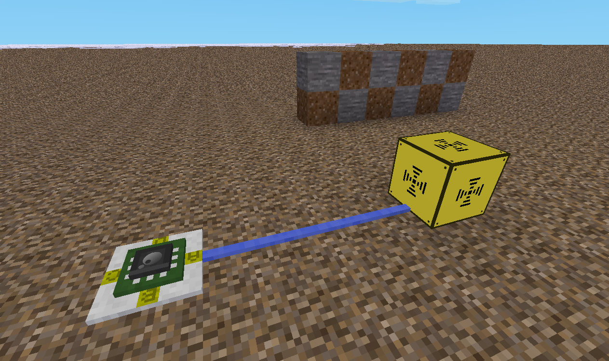

Minetest digibuilder
======

Build nodes with digiline commands


[](https://content.minetest.net/packages/BuckarooBanzay/digibuilder/)



# Overview

Allows the mesecons luacontroller to build things to the world

# Settings

* **digibuilder.max_radius** max radius, default: 15 nodes
* **digibuilder.setnode_delay** delay between setnode calls in seconds, default: 0.5

# Commands

## Get node

```lua
digiline_send("digibuilder", {
  command = "getnode",
  pos = { x=1, y=0, z=0 }
})

if event.type == "digiline" and event.channel == "digibuilder" then
  -- { error = true, message = "..." }
  -- { pos = { x=1, y=0, z=0 }, name = "default:stone" }
  -- { pos = { x=1, y=0, z=0 }, name = "stairs:stair_stone", param2 = 3 }
end
```

## Set node

```lua
digiline_send("digibuilder", {
  command = "setnode",
  pos = { x=1, y=0, z=0 },
  param2 = 3,
  name = "stairs:stair_stone"
})

if event.type == "digiline" and event.channel == "digibuilder" then
  -- { error = true, message = "..." }
  -- { pos = { x=1, y=0, z=0 }, success = true, name = "default:stone" }
  -- { pos = { x=1, y=0, z=0 }, success = true, name = "stairs:stair_stone", param2 = 3 }
end
```

### pointed_thing handling

If none of the fields { up, down, north, south, west, east, auto } are set to true
then a zero orientational pointed_thing is used. i.e. under == above coordinates.
If auto field is set to true, then a direction is set based on the evaluated param2
or falls back to downward direction.
Some nodes need a support-node to be at under position or they will be placed in
the resulting under-coordinate. e.g. technic:hv_cable_plate_1

# Examples

For code examples for the `luacontroller` see the "examples" directory


# License

* Code: MIT
* Textures: CC-BY-SA 3.0
